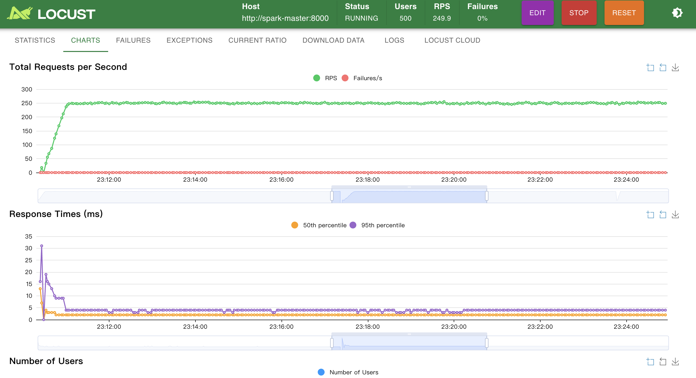

# Quick Start Guide

Run the following commands **exactly in order** (each step has been verified).


## Phase 1: Orchestration with Prefect

### Steps:

1. **Start every service**

    ```bash
    # 1. Start every service
    docker-compose up -d
    ```

2. **Fetch the spark-master container ID**

    ```bash
    # 2. Fetch the spark-master container ID
    CONTAINER=$(docker-compose ps -q spark-master)
    ```

3. **Install the base dependencies inside the container**

    ```bash
    # 3. Install the base dependencies inside the container
    docker exec -it $CONTAINER pip install \
        prefect \
        mlflow \
        structlog \
        pandas \
        scikit-learn \
        pyyaml \
        delta-spark==2.4.0 \
        kafka-python==2.0.2
    ```

4. **Install Prefect 2.x (<3.0 is required)**

    ```bash
    # 4. Install Prefect 2.x (<3.0 is required)
    docker exec -it $CONTAINER pip install "prefect>=2.0.0,<3.0.0"
    ```

5. **Initialize the Delta Lake tables**

    ```bash
    # 5. Initialize the Delta Lake tables (create the required tables in MinIO)
    docker exec -w /app -it $CONTAINER python src/init_delta_tables.py
    ```

6. **Run the model retraining flow (critical step)**

    ```bash
    # 6. Run the model retraining flow (critical step)
    docker exec \
      -e PREFECT_HOME=/tmp/.prefect \
      -e MLFLOW_TRACKING_URI=http://mlflow:5000 \
      -e PREFECT_API_URL=http://prefect:4200/api \
      -w /app \
      -it $CONTAINER python -m src.pipelines.retraining_flow
    ```

### Expected Results

- Prefect UI (http://localhost:4200) shows the flow run in green (success)
- MLflow UI (http://localhost:5000) -> Models page lists `Recommendation_SVD` with the latest version promoted to `Production`


## Phase 2: Model Registry & Quality Gates

### Steps:

```bash
# 7. Exercise the model hot-reload API (confirm the Production model is loaded by the service)
docker exec -w /app -it $CONTAINER python -c \
  "import requests; print(requests.post('http://localhost:8000/admin/reload-models').json())"
```

Expected response (example):

```json
{
  "status": "success",
  "message": "Models reloaded from Production",
  "current_state": {
    "Recommendation_SVD": {
      "version": "1",
      "stage": "Production",
      "loaded_at": "2025-12-04T08:88:88.888888"
    }
  }
}
```


## Phase 3: Quality Assurance & Automation

**Install all dev tooling:**

```bash
make install-dev
```

Automatically creates a virtualenv, installs every tool, and configures the Git hooks.

**Activate the virtual environment:**

```bash
source venv_py313/bin/activate
```

**Code quality checks (for daily work):**

```bash
make ci              # lint + type-check
make format          # format code with Black + isort
make lint            # run Flake8 + Bandit
make type-check      # run MyPy
make pre-commit      # execute every pre-commit hook
```

**Load testing:**

```bash
make load-test              # start the Locust UI (http://localhost:8089)
make load-test-headless     # headless run (5 min, 100 users)
```

**Unit tests (requires the full dependency stack):**

```bash
make ci-test         # CI workflow + unit tests
make test            # unit tests only
make test-smoke      # smoke tests
```

**Locust Monitoring:**

Under a high load of 500, our system maintains a P95 latency of under 6 milliseconds, which ensures a smooth experience for our users.



**Grafana Dashboard Monitoring:**

Including API Error Rate (%), In-flight Requests, API Latency (p95), API Throughput (Requests Per Second)


## Phase 3's Tooling

| Tool | Purpose | Config File |
|------|---------|-------------|
| Black | Code formatting | pyproject.toml |
| isort | Import sorting | pyproject.toml |
| Flake8 | Code linting | .flake8 |
| MyPy | Static type checking | pyproject.toml |
| Bandit | Security scanning | pyproject.toml |
| pytest | Unit testing | pyproject.toml |
| pre-commit | Git hooks | .pre-commit-config.yaml |
| Locust | Load testing | tests/locustfile.py |


## Phase 4: CI/CD Pipeline

In this phase, the entire MLOps stack becomes fully automated through GitHub Actions, achieving zero-touch testing and deployment.

### Steps: 

1. Add or update locally inside the project:
   
```bash
.github/workflows/ci-cd.yml
```

2. Commit your changes
 
```bash
git add .
git commit -m "feat: update recommendation engine"
```

3. Push to GitHub and this automatically triggers the full CI/CD workflow:

```bash
git push origin main
```


